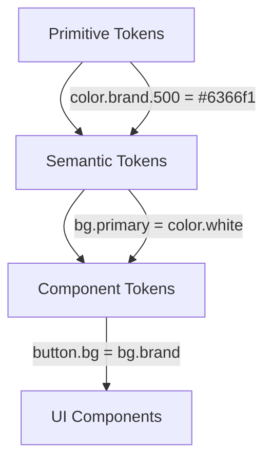

# Brand System

Design auf höchstem Niveau.

<div class="abs-br m-6 flex gap-2">
  <a href="https://github.com" target="_blank" class="text-xl slidev-icon-btn">
    <carbon-logo-github />
  </a>
</div>

---
layout: intro
---

# Wer wir sind

<div class="leading-8 opacity-80">
Wir bauen Design-Systeme, die skalieren.<br>
Von der Landing Page bis zum Slide Deck – alles aus einem Guss.<br>
Multi-Brand. Blitzschnell. Kompromisslos.
</div>

<div class="my-10 grid grid-cols-[40px_1fr] gap-y-4">
  <ri-palette-line class="opacity-50" />
  <div><span class="font-bold">Design Tokens</span> – Farben, Typo, Spacing als Code</div>
  <ri-code-s-slash-line class="opacity-50" />
  <div><span class="font-bold">Component Library</span> – Wiederverwendbare UI-Bausteine</div>
  <ri-slideshow-line class="opacity-50" />
  <div><span class="font-bold">Slides as Code</span> – Präsentationen in Markdown</div>
</div>

---
layout: section
---

# Design Tokens

Das Fundament des Systems.

---

# Token-Architektur

Drei Ebenen für maximale Flexibilität:



<v-click>

**Primitive** → Rohe Werte (Farben, Größen, Schriften)

**Semantic** → Bedeutung (bg.primary, text.secondary, border.focus)

**Component** → Anwendung (button.bg, card.shadow, nav.height)

</v-click>

---

# Farbpalette

<div class="grid grid-cols-2 gap-8 mt-8">
<div>

### Brand

<div class="flex gap-1 mt-4">
  <div class="w-12 h-12 rounded-lg bg-[#eef2ff]"></div>
  <div class="w-12 h-12 rounded-lg bg-[#c7d2fe]"></div>
  <div class="w-12 h-12 rounded-lg bg-[#818cf8]"></div>
  <div class="w-12 h-12 rounded-lg bg-[#6366f1]"></div>
  <div class="w-12 h-12 rounded-lg bg-[#4f46e5]"></div>
  <div class="w-12 h-12 rounded-lg bg-[#3730a3]"></div>
  <div class="w-12 h-12 rounded-lg bg-[#1e1b4b]"></div>
</div>

</div>
<div>

### Accent

<div class="flex gap-1 mt-4">
  <div class="w-12 h-12 rounded-lg bg-[#fff7ed]"></div>
  <div class="w-12 h-12 rounded-lg bg-[#fed7aa]"></div>
  <div class="w-12 h-12 rounded-lg bg-[#fb923c]"></div>
  <div class="w-12 h-12 rounded-lg bg-[#f97316]"></div>
  <div class="w-12 h-12 rounded-lg bg-[#ea580c]"></div>
  <div class="w-12 h-12 rounded-lg bg-[#9a3412]"></div>
  <div class="w-12 h-12 rounded-lg bg-[#7c2d12]"></div>
</div>

</div>
</div>

<div class="mt-8 text-sm opacity-60">

Alle Farben werden aus `packages/tokens/src/primitives/colors.json` generiert und automatisch zu CSS Custom Properties, Tailwind Config und JavaScript exportiert.

</div>

---

# Typografie

<div class="mt-8 space-y-6">
  <div>
    <p class="text-xs uppercase tracking-widest opacity-50 mb-2">Display / Headlines</p>
    <p class="text-5xl font-extrabold tracking-tight">Inter Extrabold</p>
  </div>
  <div>
    <p class="text-xs uppercase tracking-widest opacity-50 mb-2">Body / Fließtext</p>
    <p class="text-xl font-light leading-relaxed">Inter Light – für angenehmes Lesen auf allen Geräten.</p>
  </div>
  <div>
    <p class="text-xs uppercase tracking-widest opacity-50 mb-2">Code / Monospace</p>
    <p class="font-mono text-lg">JetBrains Mono – für Code-Snippets.</p>
  </div>
</div>

---
layout: two-cols
layoutClass: gap-16
---

# Komponenten

Wiederverwendbare Bausteine für jedes Projekt.

::right::

<div class="space-y-4 mt-4">
  <div class="px-5 py-2.5 bg-[#4f46e5] text-white rounded-lg text-center font-medium shadow-md">Button Primary</div>
  <div class="px-5 py-2.5 bg-white border border-gray-200 text-gray-900 rounded-lg text-center font-medium shadow-sm">Button Secondary</div>
  <div class="p-6 bg-white rounded-xl shadow-lg border border-gray-100">
    <p class="font-semibold">Card Component</p>
    <p class="text-sm text-gray-500 mt-1">Elevated variant mit Schatten</p>
  </div>
  <div class="px-3 py-1 bg-[#eef2ff] text-[#4f46e5] rounded-full text-xs font-medium inline-block">Badge</div>
</div>

---
layout: section
---

# Multi-Brand

Ein System. Viele Marken.

---

# Theme-Wechsel

```json
// themes/client-a/tokens.json
{
  "color": {
    "brand": {
      "500": { "$value": "#e11d48" },
      "600": { "$value": "#be123c" }
    }
  },
  "font": {
    "family": {
      "display": { "$value": "'Playfair Display', serif" }
    }
  }
}
```

<v-click>

→ **Ein Befehl** (`pnpm tokens:build`) und das gesamte System hat ein neues Branding.

→ Websites, Slides, Komponenten – alles aktualisiert sich automatisch.

</v-click>

---
layout: center
class: text-center
---

# Bereit?

Starte jetzt mit dem Brand System.

<div class="mt-8 flex gap-4 justify-center">
  <a href="#" class="px-6 py-3 bg-[#4f46e5] text-white rounded-lg font-medium shadow-md hover:bg-[#4338ca] transition-colors">
    Repository klonen
  </a>
  <a href="#" class="px-6 py-3 border border-gray-300 text-gray-700 rounded-lg font-medium hover:bg-gray-50 transition-colors">
    Dokumentation
  </a>
</div>

---
layout: end
---

Danke!

<div class="text-sm opacity-60 mt-4">
Erstellt mit Slidev + Brand System Design Tokens
</div>
